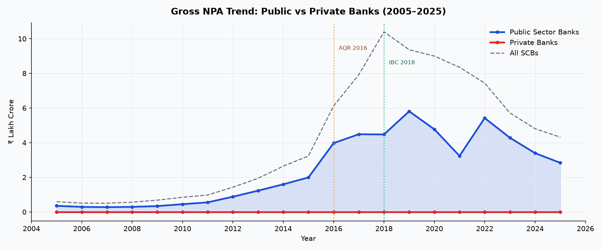
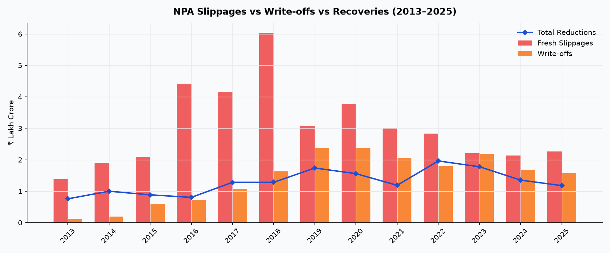
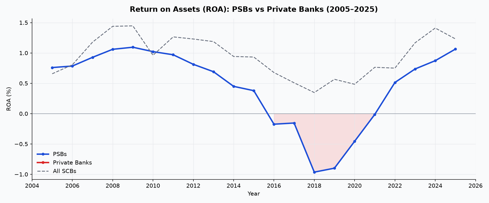
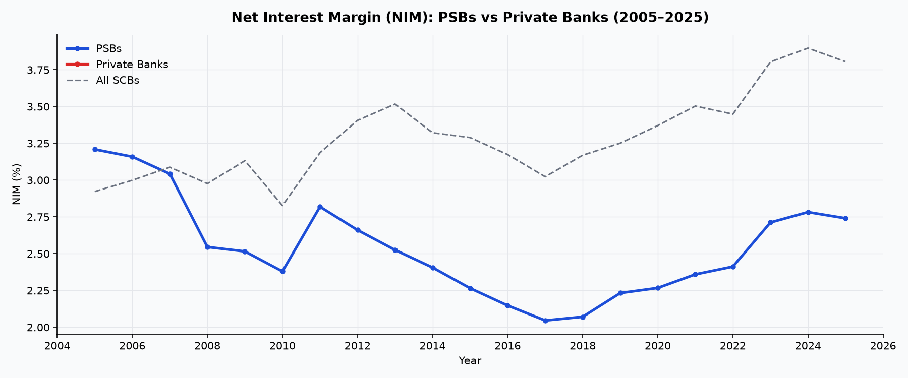
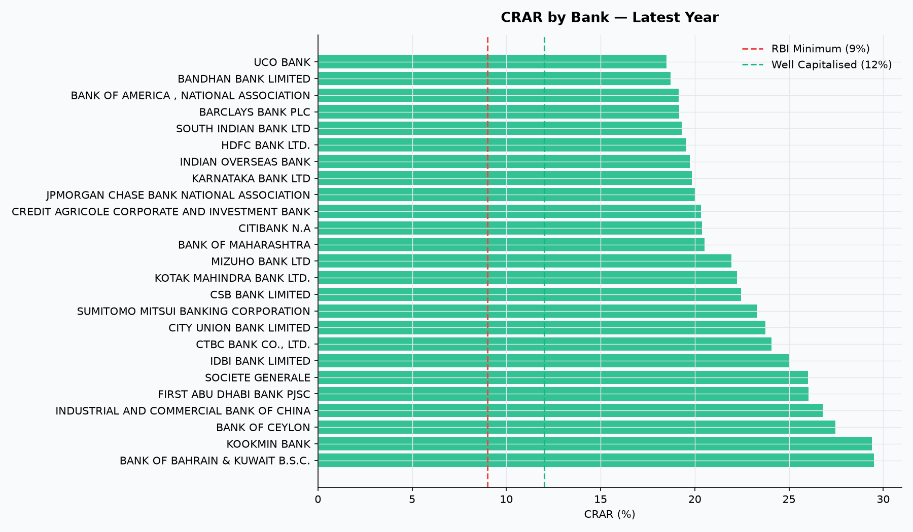
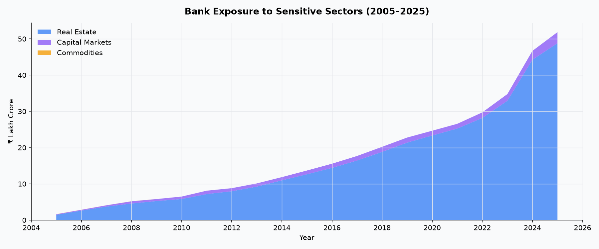

# Indian Banking Health Tracker

An end-to-end data analytics project analyzing 20 years of RBI banking data (2005–2025) using MySQL, Python, and Power BI.

## Project Overview

This project examines the health of India's scheduled commercial banks using publicly available data from the Reserve Bank of India (RBI). It covers NPA trends, capital adequacy, profitability ratios, and sensitive sector exposure across 70+ banks.

## Key Findings

- PSB gross NPAs peaked at ₹5.8 lakh crore in 2019, declining 52% to ₹2.8 lakh crore by 2025 following IBC enforcement
- PSB Return on Assets (ROA) bottomed at -0.96% in 2018, recovering to +1.06% by 2025
- As of 2025, no scheduled commercial bank falls below RBI's minimum CRAR requirement of 9%
- Real estate sector exposure by banks has grown steadily from 2012 to 2025, representing the largest share of sensitive sector exposure

## Data Source

Reserve Bank of India — Statistical Tables Relating to Banks in India (DBIE Portal)

Tables used:
- Table 1: Liabilities and Assets of Scheduled Commercial Banks
- Table 2: Earnings and Expenses
- Table 3: Bank-wise Capital Adequacy Ratios (CRAR)
- Table 6: Movement of Non-Performing Assets (NPAs)
- Table 8: Exposure to Sensitive Sectors
- Table 10: Bank Group-wise Select Ratios
- Table 11: Select Ratios of Scheduled Commercial Banks

## Project Structure

| File | Description |
|---|---|
| `clean_data_mysql.py` | Parses 7 RBI Excel files and loads 9,577 rows into MySQL |
| `analysis_queries.sql` | 12 analytical SQL queries covering NPA, ROA, CRAR, CDR, NIM |
| `eda.py` | Python EDA script generating 6 matplotlib charts |
| `banking_proj.pbix` | 4-page interactive Power BI dashboard |
| `chart1_npa_trend.png` | Gross NPA trend: PSB vs Private Banks |
| `chart2_writeoffs_vs_recoveries.png` | NPA slippages vs write-offs vs recoveries |
| `chart3_roa_trend.png` | ROA trend: PSB vs Private Banks |
| `chart4_nim_trend.png` | Net Interest Margin trend |
| `chart5_crar_distribution.png` | CRAR distribution by bank |
| `chart6_sensitive_sectors.png` | Sensitive sector exposure over time |

## Tools & Technologies

- **Python**: pandas, openpyxl, matplotlib, sqlalchemy
- **SQL**: MySQL, MySQL Workbench
- **Visualization**: Power BI Desktop, matplotlib

## Dashboard Pages

1. **Overview** — 4 KPI cards (Gross NPA, Avg ROA, Avg CRAR, Total Advances) + NPA trend + ROA trend
2. **NPA Deep Dive** — Top 10 banks by NPA, slippages vs write-offs, net NPA trend
3. **Bank Comparison** — NIM trend, CRAR by bank, ROA vs NIM scatter, profitability scorecard
4. **Risk & Exposure** — Sensitive sector exposure, NPA recovery rates, CRAR adequacy

## EDA Charts

### Gross NPA Trend: PSB vs Private Banks

### NPA Slippages vs Write-offs vs Recoveries

### Return on Assets: PSB vs Private Banks

### Net Interest Margin Trend

### CRAR Distribution by Bank

### Sensitive Sector Exposure

